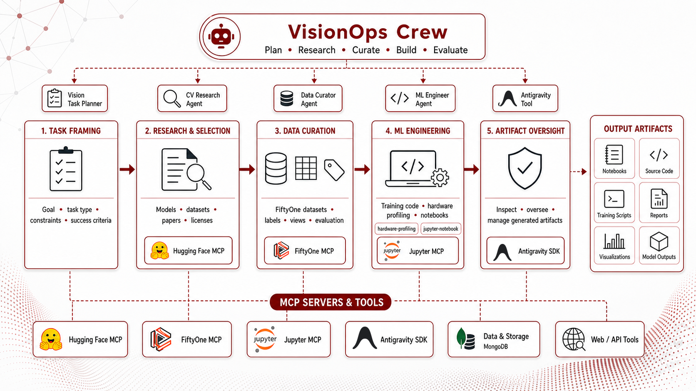
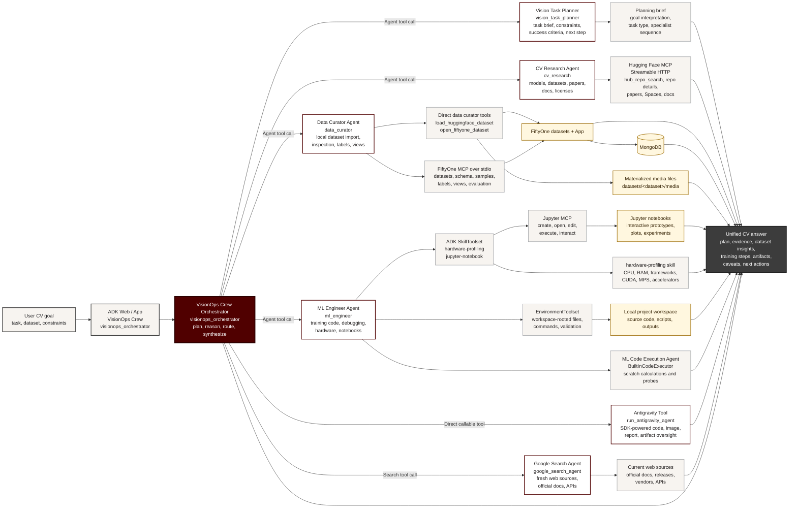
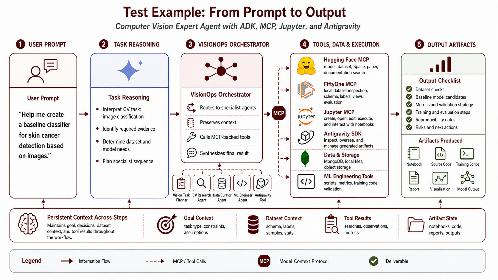

# VisionOps Crew

`visionops_crew` is a multi-agent computer vision assistant built with the
Google Agent Development Kit (ADK) and Antigravity SDK. It combines model
research, dataset inspection, FiftyOne/Voxel51 data curation, Hugging Face
discovery, local ML engineering, Jupyter MCP notebook workflows, web search, and
opt-in Antigravity SDK execution behind one orchestrated ADK app:
`visionops_orchestrator`.

The project is designed for practical computer vision work where one request
often spans several systems. For example, you can ask the orchestrator to find a
dataset, import a sample into FiftyOne, inspect labels and schema quality,
identify a baseline model, and produce a training plan for your local hardware.
`visionops_orchestrator` routes each step to the right specialist and returns a
single consolidated answer.



## What this repository provides

- A root `visionops_orchestrator` ADK app that coordinates specialist agents.
- A task-planning agent for turning broad CV requests into actionable briefs.
- A CV research agent with Hugging Face MCP tools for models, datasets, Spaces,
  papers, documentation, and licenses.
- A data curator agent with FiftyOne/Voxel51 tools for dataset import,
  inspection, summaries, filtering, schema checks, and App coordination.
- An ML engineering agent with hardware profiling, local execution tools, and
  Jupyter MCP notebook support.
- An opt-in Antigravity SDK tool, exposed only through the orchestrator, for
  implementation-heavy code, image, notebook, and report generation tasks.
- A Docker Compose MongoDB service for FiftyOne metadata.
- Helper scripts for loading sample datasets, launching FiftyOne, and deleting
  local FiftyOne datasets.

## How the system works

The main ADK app is `visionops_orchestrator`. It acts as a parent agent that
calls specialist agents and tools, decides where each part of a request should
go, compares specialist outputs, and synthesizes the final response.



The usual flow is:

1. The user asks a computer vision question in the `visionops_orchestrator` ADK app.
2. The orchestrator calls the planner for broad or multi-step requests.
3. Model and dataset research go to `cv_research` or Google Search.
4. Local dataset work goes to `data_curator`.
5. Training plans, code, and hardware-sensitive recommendations go to `ml_engineer`.
6. Notebook prototyping goes through Jupyter MCP when the user approves notebook
   changes or execution.
7. Antigravity is available as an optional super-agent attached to the
   orchestrator. Use it when you want stronger implementation support, generated
   images, notebooks, reports, or artifact oversight; it is called only after an
   explicit user request and confirmation.
8. The orchestrator merges the specialist outputs into one practical response.



## Agents

| Agent name | Purpose |
| --- | --- |
| `visionops_orchestrator` | Main multi-agent orchestrator. Start here for normal use. |
| `vision_task_planner` | Plans ambiguous or multi-step computer vision workflows. |
| `cv_research` | Researches CV models, datasets, Spaces, papers, docs, and licenses through Hugging Face MCP-backed tools. |
| `data_curator` | Loads, opens, inspects, filters, and summarizes FiftyOne datasets. |
| `ml_engineer` | Builds hardware-aware training, evaluation, debugging, and notebook prototyping workflows. |

`run_antigravity_agent` is a direct orchestrator tool, not a specialist app.
Antigravity stays opt-in: the root agent calls it only when the user explicitly
requests Antigravity, and file creation or editing remains denied unless the
user confirms the exact write action.

## Quick start

Run the local workflow in this order:

```bash
git clone git@github.com:haruiz/visionops_crew.git
cd visionops_crew
uv sync
cp .env.example .env
make run-mongo
make run-jupyter
make run-crew
```

Edit `.env` with your model settings and tokens before starting Jupyter. Then
open the `visionops_orchestrator` app in the ADK web UI.

## Configuration

Requirements:

- Python 3.11 or newer
- `uv`
- Docker with Docker Compose
- A Google ADK-compatible model configuration
- Optional: `HF_TOKEN` for private Hugging Face datasets or higher API limits

Copy `.env.example` to `.env`, then set only the values you need to override:

```bash
cp .env.example .env
```

```bash
VISIONOPS_ORCHESTRATOR_MODEL=gemini-3.5-flash
GOOGLE_SEARCH_MODEL=gemini-3.5-flash
VISION_TASK_PLANNER_MODEL=gemini-3.5-flash
CV_RESEARCH_MODEL=gemini-3.5-flash
DATA_CURATOR_MODEL=gemini-3.5-flash
ML_ENGINEER_MODEL=gemini-3.5-flash
ML_CODE_EXECUTION_MODEL=gemini-3.5-flash
GEMINI_API_KEY=YOUR_GEMINI_API_KEY
HF_TOKEN=YOUR_HUGGINGFACE_TOKEN
VISIONOPS_CREW_DATASETS_DIR=./datasets
FIFTYONE_APP_ADDRESS=0.0.0.0
FIFTYONE_APP_PORT=5151
JUPYTER_URL=http://localhost:4040
JUPYTER_TOKEN=YOUR_JUPYTER_TOKEN
```

## Commands

| Task | Command |
| --- | --- |
| Sync dependencies | `uv sync` |
| Start MongoDB | `make run-mongo` |
| Stop MongoDB | `make mongo-down` |
| Restart MongoDB | `make mongo-restart` |
| Reset MongoDB data | `make mongo-reset` |
| Follow MongoDB logs | `make mongo-logs` |
| Start JupyterLab for Jupyter MCP | `make run-jupyter` |
| Start the ADK web UI | `make run-crew` |

## Repository layout

```text
.
|-- src/
|   `-- visionops_crew/
|       `-- agents/
|           |-- visionops_orchestrator/
|           |-- vision_task_planner/
|           |-- cv_research/
|           |-- data_curator/
|           `-- ml_engineer/
|-- scripts/
|-- assets/
|-- latex/
|-- docker-compose.yml
|-- Makefile
|-- pyproject.toml
`-- uv.lock
```

## Troubleshooting

- MongoDB does not start: make sure Docker is running, then run
  `make mongo-logs`. If the local data directory is incompatible with the
  current MongoDB image, run `make mongo-reset`.
- FiftyOne cannot connect: start MongoDB first with `make run-mongo`.
- Port `5151` is busy: set `FIFTYONE_APP_PORT=5152` in `.env`.
- Hugging Face access fails: set `HF_TOKEN` in `.env` or authenticate with the
  Hugging Face CLI.

## Cite

If you use VisionOps Crew in research, teaching, demos, or derivative work,
please cite the repository:

```bibtex
@software{ruiz_visionops_crew_2026,
  author = {Ruiz, Henry},
  title = {VisionOps Crew: A Multi-Agent Computer Vision Assistant},
  year = {2026},
  url = {https://github.com/haruiz/visionops_crew},
  version = {0.1.0}
}
```

## Notes

- MongoDB is required because Voxel51 FiftyOne uses it for dataset storage,
  metadata, and management. Local MongoDB data is stored in `docker-data/mongo`.
- Antigravity SDK access belongs to `visionops_orchestrator`, not the
  `ml_engineer` specialist.
- The data curator and Jupyter tools inherit this project's `.env`
  configuration.
